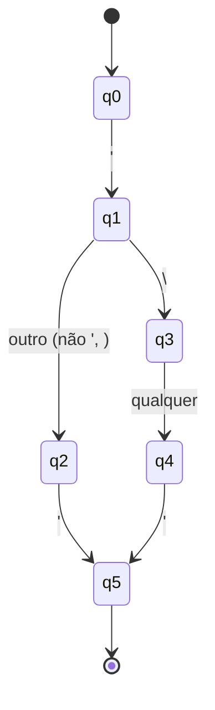

```mermaid
stateDiagram-v2
    [*] --> q0
    q0 --> q1 : '
    
    %% Caminho caractere normal
    q1 --> q2 : outro (não ', \)
    q2 --> q5 : '
    
    %% Caminho com escape
    q1 --> q3 : \
    q3 --> q4 : qualquer
    q4 --> q5 : '
    
    q5 --> [*]
```