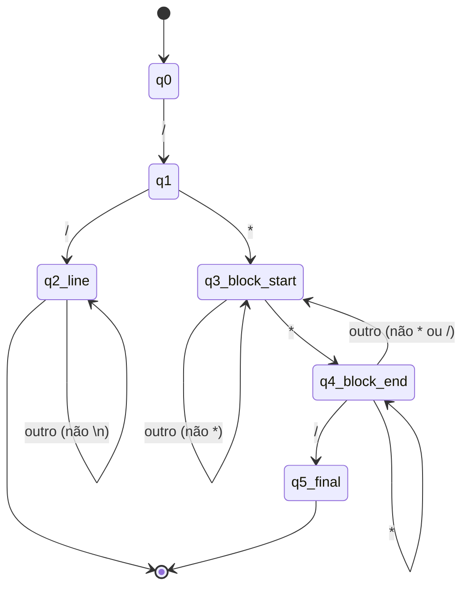

```mermaid
stateDiagram-v2
    [*] --> q0
    q0 --> q1 : /
    
    %% Caminho Comentário de Linha
    q1 --> q2_line : /
    q2_line --> q2_line : outro (não \n)
    q2_line --> [*] %% Fim (reconhecido no \n)
    
    %% Caminho Comentário de Bloco
    q1 --> q3_block_start : *
    q3_block_start --> q3_block_start : outro (não *)
    q3_block_start --> q4_block_end : *
    q4_block_end --> q3_block_start : outro (não * ou /)
    q4_block_end --> q4_block_end : *
    q4_block_end --> q5_final : /
    
    q5_final --> [*] %% Fim (bloco)
```