# Diagramas dos Autômatos Determinísticos da Linguagem SimplePoo

Cada autômato descrito abaixo foi construído manualmente utilizando tabelas
explícitas de transição. Os diagramas em Mermaid documentam o comportamento
de cada categoria de token sem depender de expressões regulares.

## KEYWORD (palavras reservadas)

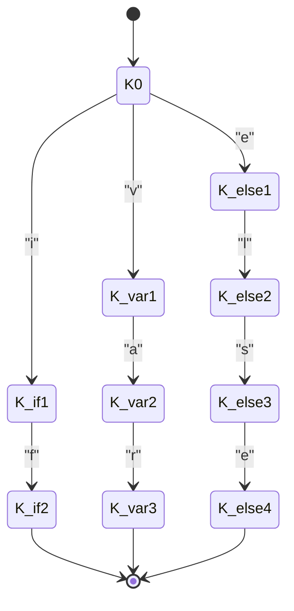

Cada caminho separado representa uma palavra reservada. O autômato real contém
transições para todas as 37 keywords definidas na especificação.

## IDENTIFIER (identificadores)

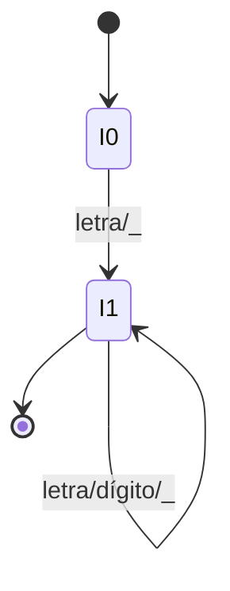

## INT_LITERAL (literais inteiros)

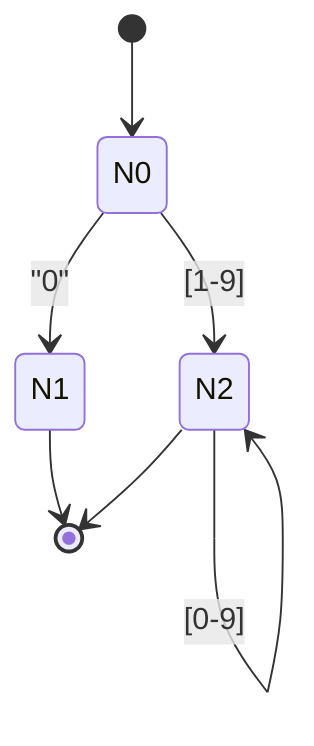

## FLOAT_LITERAL (literais decimais)

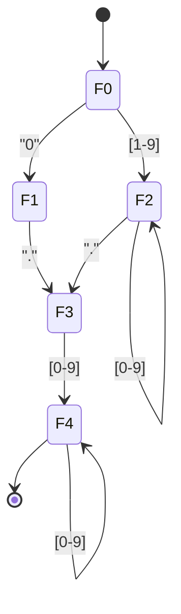

## SCIENTIFIC_LITERAL (notação científica)

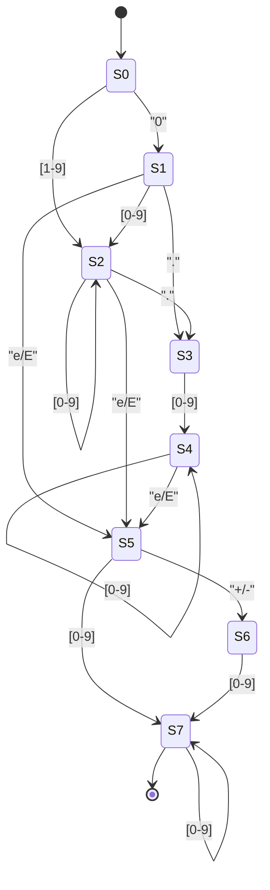

## STRING_DOUBLE / STRING_SINGLE (strings)

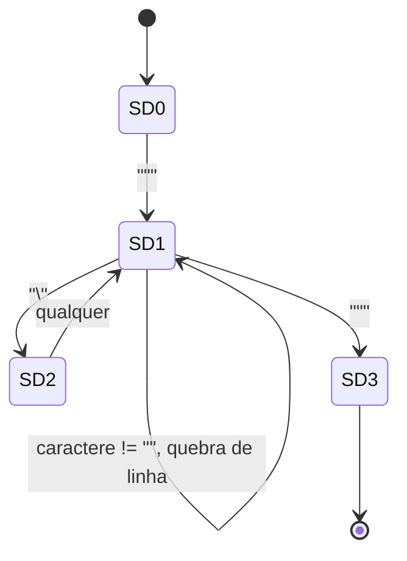

O autômato de aspas simples possui a mesma estrutura substituindo o delimitador.

## CHAR_LITERAL (caracteres)

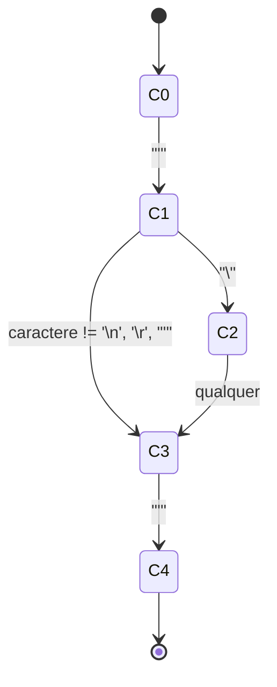

## OPERATOR (operadores)

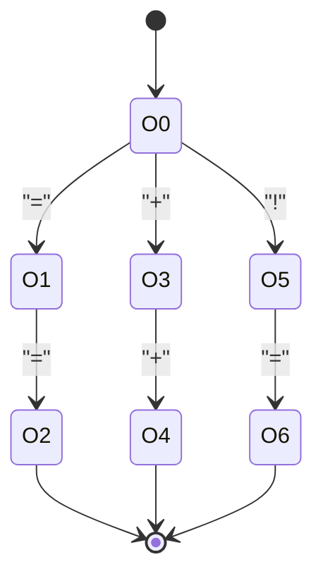

Os ramos representam os operadores compostos e simples. O autômato inclui
transições para os demais símbolos listados na especificação.

## DELIMITER (delimitadores)

```mermaid
stateDiagram-v2
    [*] --> D0
    D0 --> [*]: qualquer de (){}[];,.
```

## WHITESPACE (espaços em branco)

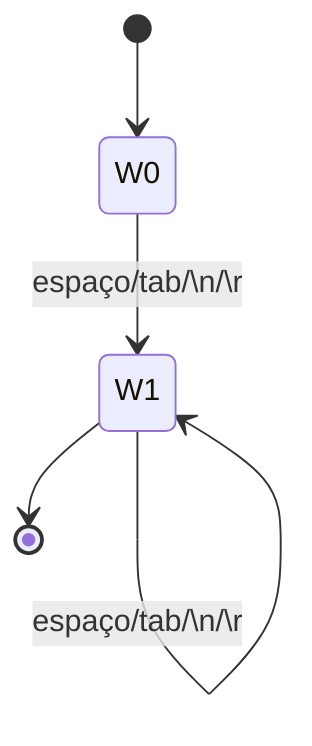

## LINE_COMMENT (comentário de linha)

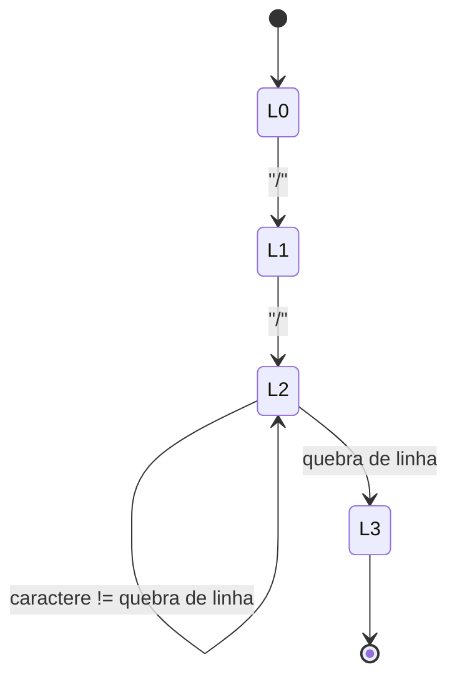

## BLOCK_COMMENT (comentário de bloco)

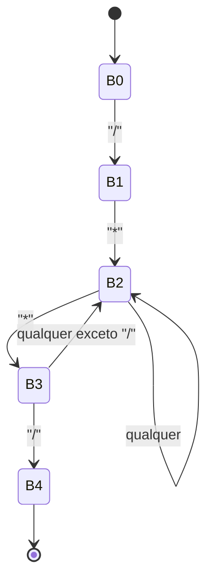

Cada um desses autômatos foi implementado na pasta `Compiladores/modulos_lexicos`
utilizando estruturas de dados explícitas, e os testes individuais podem ser
executados com `python -m unittest discover Compiladores/tests`.
