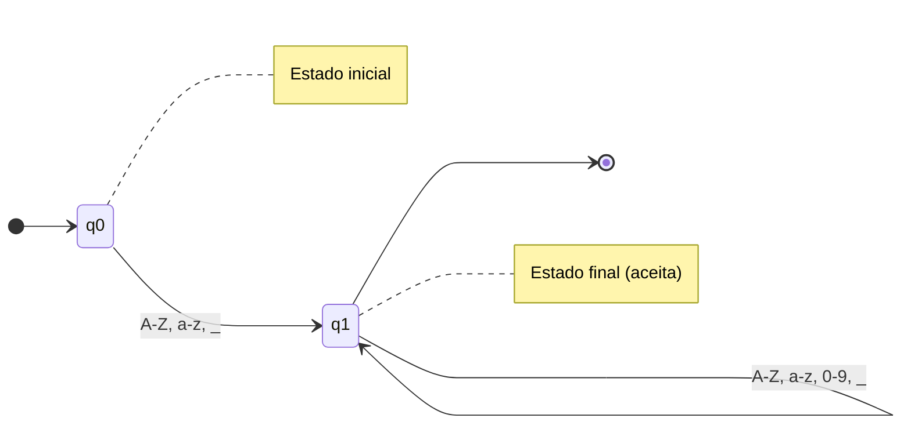
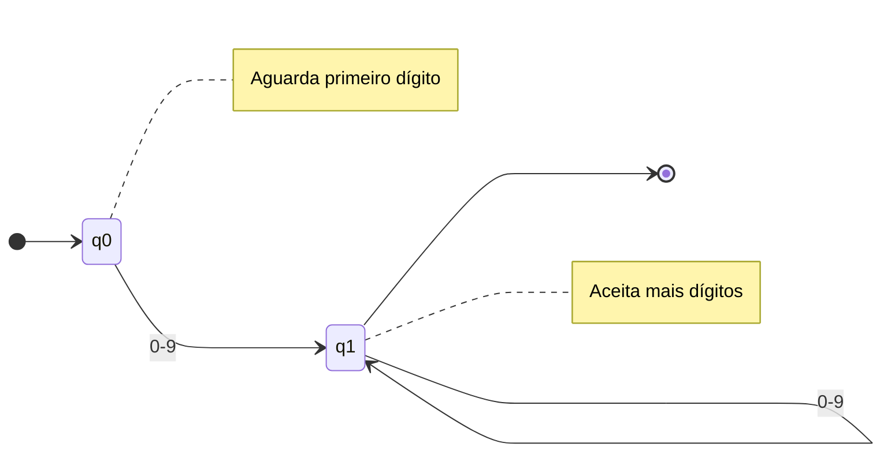
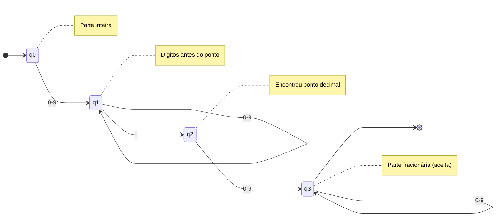
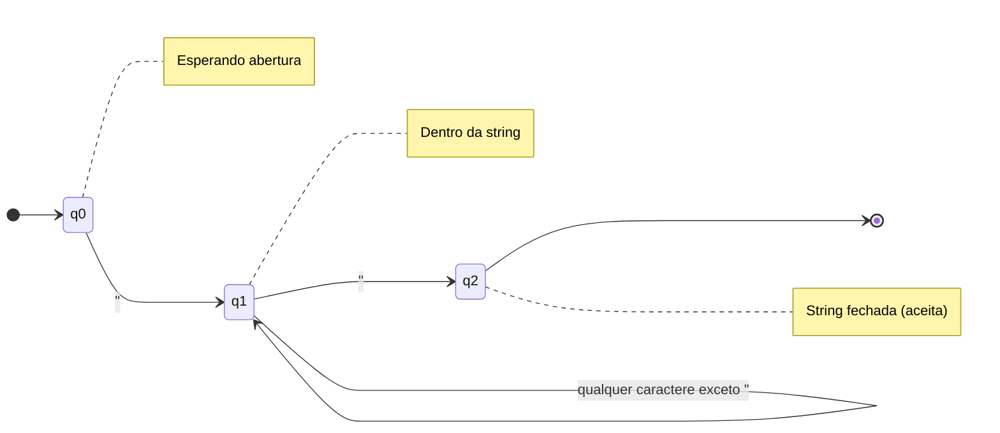
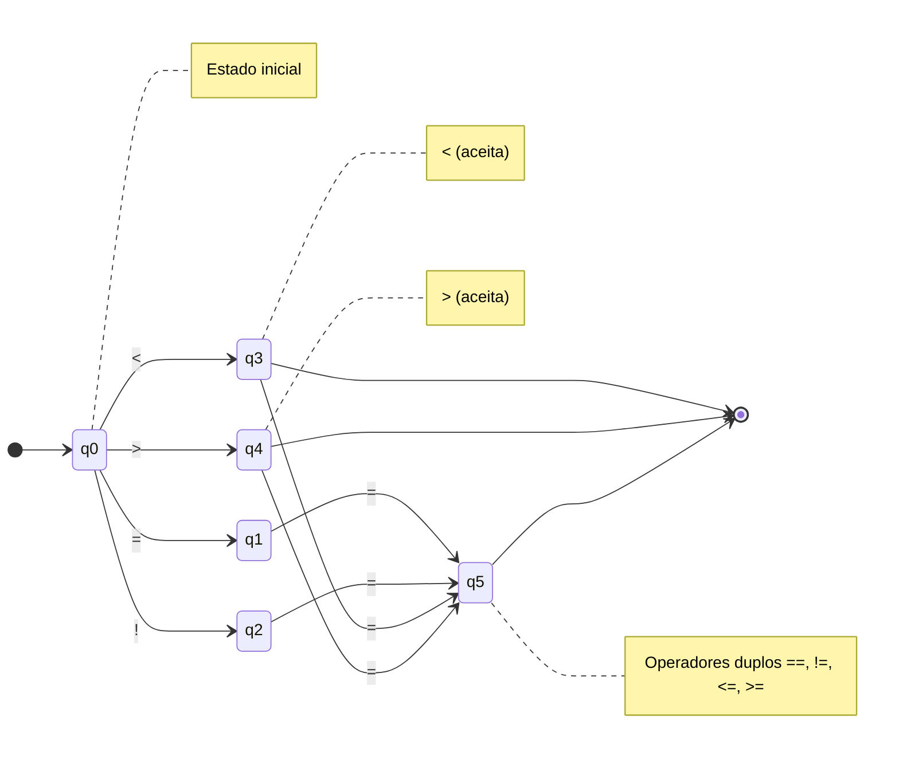
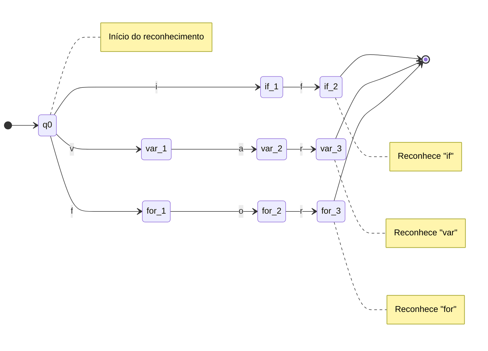
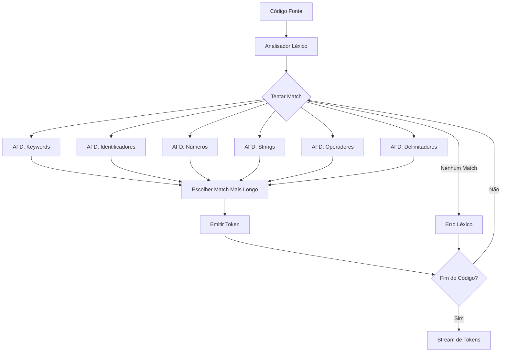
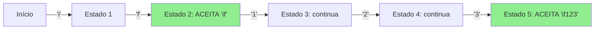

# Diagrama do Autômato Finito Determinístico (AFD) Final

Este documento apresenta o AFD resultante da conversão do AFN usado no analisador léxico.

## 🎯 Visão Geral

O AFD foi construído através do **Algoritmo de Construção de Subconjuntos**, que converte autômatos não-determinísticos (AFN) em determinísticos (AFD). O processo envolve:

1. Calcular fechamento-epsilon dos estados
2. Criar estados do AFD como conjuntos de estados do AFN
3. Construir tabela de transições determinística
4. Identificar estados de aceitação

## 📊 Estatísticas do AFD

- **Linguagem reconhecida**: Tokens da linguagem proposta
- **Método de construção**: Algoritmo de Construção de Subconjuntos
- **Total de tokens**: 25+ categorias diferentes
- **Redução de complexidade**: AFN → AFD (determinização completa)

## 🔤 AFD para IDENTIFICADORES

Reconhece: `[A-Za-z_][A-Za-z0-9_]*`



**Descrição**: 
- Estado q0: inicial, espera letra ou underscore
- Estado q1: aceita letras, dígitos ou underscore (loop)
- q1 é estado de aceitação

## 🔢 AFD para NÚMEROS INTEIROS

Reconhece: `\d+` (um ou mais dígitos)



**Descrição**:
- Estado q0: inicial, espera dígito
- Estado q1: aceita e permanece aceitando dígitos

## 🔢 AFD para NÚMEROS DECIMAIS (FLOAT)

Reconhece: `\d+\.\d+` (números com ponto decimal)



**Descrição**:
- Estados q0-q1: reconhecem parte inteira
- Estado q2: consome o ponto decimal
- Estado q3: reconhece parte fracionária (final)

## 📝 AFD para STRINGS

Reconhece: `"[^"]*"` (texto entre aspas)



**Descrição**:
- Estado q0: aguarda aspas de abertura
- Estado q1: consome caracteres da string
- Estado q2: string completa (final)

## 🔣 AFD para OPERADORES RELACIONAIS

Reconhece: `==|!=|<=|>=|<|>` (operadores de comparação)



**Descrição**:
- Estado q0: lê primeiro caractere do operador
- Estados q1-q4: operadores parciais
- Estados q3, q4, q5: estados de aceitação

## 🎯 AFD para KEYWORDS

Reconhece palavras-chave como: `if`, `else`, `for`, `while`, `var`, etc.



**Descrição**: AFD combinado para múltiplas keywords. Cada palavra tem seu próprio caminho até um estado final.

## 🏗️ AFD Unificado do Analisador Léxico

O analisador léxico completo usa **múltiplos AFDs em paralelo**, um para cada categoria de token. O algoritmo:

1. **Para cada posição** no código fonte
2. **Tenta todos os AFDs** simultaneamente
3. **Escolhe o match mais longo** (estratégia gulosa)
4. **Prioriza** tokens mais específicos (keywords antes de identificadores)

### Arquitetura do Sistema



## 📈 Complexidade do AFD

| Aspecto | Valor |
|---------|-------|
| **Tempo de execução** | O(n) onde n = tamanho do código |
| **Espaço (memória)** | O(m) onde m = número de estados |
| **Pior caso de estados** | 2^k onde k = estados do AFN |
| **Caso médio** | Linear em k |

## 🔍 Exemplo de Reconhecimento

Para o código: `var int x as 10;`

### Passo a passo:

1. **Posição 0**: Testa todos os AFDs
   - AFD Keywords: reconhece "var" ✅ (3 chars)
   - AFD Identifier: reconhece "var" ✅ (3 chars)
   - **Prioridade**: Keywords > Identifier
   - **Resultado**: Token(KEYWORD, "var")

2. **Posição 4**: Após espaço
   - AFD Keywords: reconhece "int" ✅ (3 chars)
   - **Resultado**: Token(KEYWORD, "int")

3. **Posição 8**: Após espaço
   - AFD Identifier: reconhece "x" ✅ (1 char)
   - **Resultado**: Token(IDENTIFIER, "x")

4. **Posição 10**: Após espaço
   - AFD Keywords: reconhece "as" ✅ (2 chars)
   - **Resultado**: Token(KEYWORD, "as")

5. **Posição 13**: Após espaço
   - AFD Int: reconhece "10" ✅ (2 chars)
   - **Resultado**: Token(INT_LITERAL, "10")

6. **Posição 15**:
   - AFD Delimitador: reconhece ";" ✅ (1 char)
   - **Resultado**: Token(SEMICOLON, ";")

### Tokens Finais:
```
KEYWORD       "var"
KEYWORD       "int"
IDENTIFIER    "x"
KEYWORD       "as"
INT_LITERAL   "10"
SEMICOLON     ";"
```

## 🎨 Visualização de Estado Durante Execução

Para palavra "if123":



**Resultado**: Keyword "if" tem prioridade, então retorna token `KEYWORD("if")` e continua em "123".

## 🧪 Casos de Teste

| Entrada | Token Reconhecido | AFD Usado |
|---------|-------------------|-----------|
| `var` | KEYWORD | Keywords |
| `variavel` | IDENTIFIER | Identificadores |
| `123` | INT_LITERAL | Números Inteiros |
| `3.14` | FLOAT_LITERAL | Números Decimais |
| `"hello"` | STRING_LITERAL | Strings |
| `==` | RELOP | Operadores Relacionais |
| `+` | ARITHOP | Operadores Aritméticos |
| `{` | LBRACE | Delimitadores |

## ✅ Propriedades Garantidas

O AFD construído garante:

1. **Determinismo**: Para cada estado e símbolo, há no máximo uma transição
2. **Completude**: Todos os tokens válidos são reconhecidos
3. **Maximal Munch**: Sempre escolhe o match mais longo possível
4. **Prioridade**: Keywords têm precedência sobre identificadores
5. **Eficiência**: Tempo linear O(n) na análise

## 📚 Referências

- **Algoritmo de Construção de Subconjuntos**: Aho, Sethi, Ullman - "Compilers: Principles, Techniques, and Tools"
- **Implementação**: `/src/lexer/afn_to_afd.py`
- **Uso**: `/src/lexer/lexer.py`

---

**Nota**: Este AFD é gerado automaticamente a partir das expressões regulares definidas na especificação da linguagem. Modificações nas regex resultarão em AFDs diferentes.
