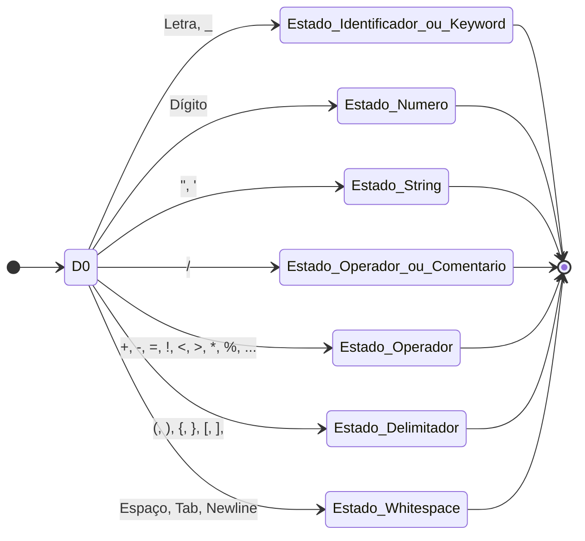

```mermaid
stateDiagram-v2
    direction LR

    [*] --> D0

    D0 --> Estado_Identificador_ou_Keyword : Letra, _
    D0 --> Estado_Numero : Dígito
    D0 --> Estado_String : ", '
    D0 --> Estado_Operador_ou_Comentario : / 
    D0 --> Estado_Operador : +, -, =, !, <, >, *, %, ...
    D0 --> Estado_Delimitador : (, ), {, }, [, ],
    D0 --> Estado_Whitespace : Espaço, Tab, Newline

    Estado_Identificador_ou_Keyword --> [*]
    Estado_Numero --> [*]
    Estado_String --> [*]
    Estado_Operador_ou_Comentario --> [*]
    Estado_Operador --> [*]
    Estado_Delimitador --> [*]
    Estado_Whitespace --> [*]
```