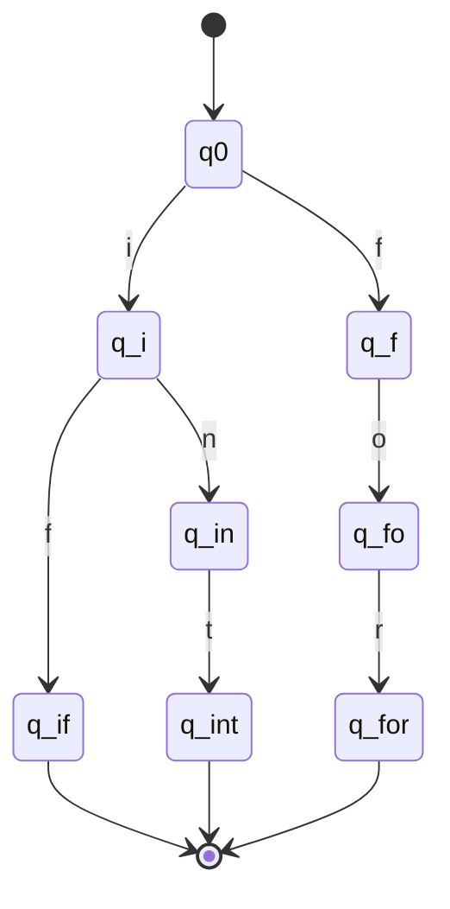

```mermaid
stateDiagram-v2
    [*] --> q0

    %% Caminho "if" e "int"
    q0 --> q_i : i
    q_i --> q_if : f
    q_if --> [*] %% Aceita "if"
    
    q_i --> q_in : n
    q_in --> q_int : t
    q_int --> [*] %% Aceita "int"

    %% Caminho "for"
    q0 --> q_f : f
    q_f --> q_fo : o
    q_fo --> q_for : r
    q_for --> [*] %% Aceita "for"
```