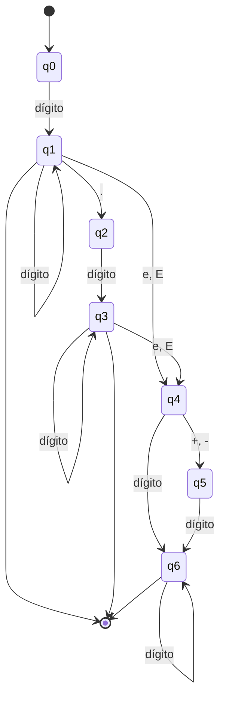

```mermaid
stateDiagram-v2
    [*] --> q0
    q0 --> q1 : dígito

    %% Caminho Inteiro
    q1 --> q1 : dígito
    q1 --> [*]  

    %% Caminho Decimal
    q1 --> q2 : .
    q2 --> q3 : dígito
    q3 --> q3 : dígito
    q3 --> [*]  

    %% Caminho Científico (pode vir de q1 ou q3)
    q1 --> q4 : e, E
    q3 --> q4 : e, E
    
    q4 --> q5 : +, -
    q4 --> q6 : dígito
    q5 --> q6 : dígito
    q6 --> q6 : dígito
    q6 --> [*]
```