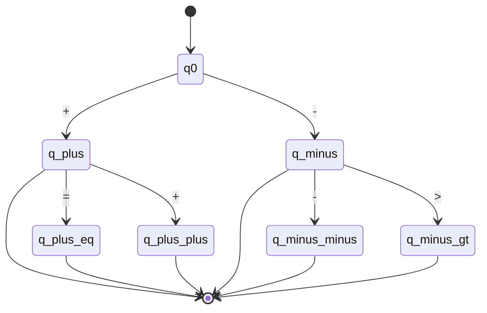

```mermaid
stateDiagram-v2
    [*] --> q0

    %% Caminhos do "+"
    q0 --> q_plus : +
    q_plus --> [*]            %% Aceita "+"
    q_plus --> q_plus_eq : =
    q_plus_eq --> [*]         %% Aceita "+="
    q_plus --> q_plus_plus : +
    q_plus_plus --> [*]     %% Aceita "++"

    %% Caminhos do "-"
    q0 --> q_minus : -
    q_minus --> [*]           %% Aceita "-"
    q_minus --> q_minus_minus : -
    q_minus_minus --> [*]   %% Aceita "--"
    q_minus --> q_minus_gt : >
    q_minus_gt --> [*]        %% Aceita "->"
```