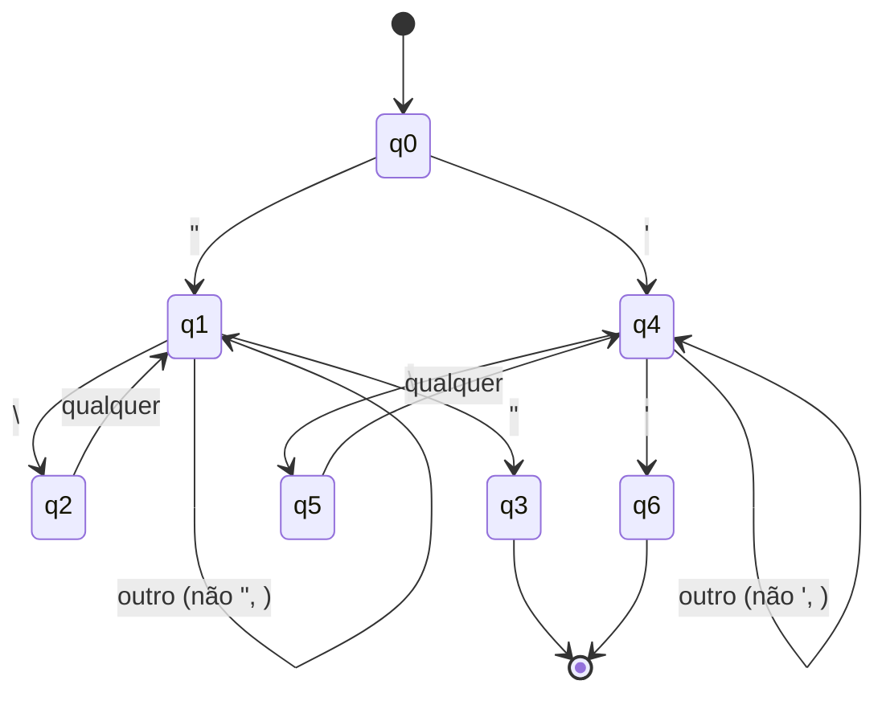

```mermaid
stateDiagram-v2
    [*] --> q0
    
    %% Caminho Aspas Duplas
    q0 --> q1 : "
    q1 --> q1 : outro (não ", \)
    q1 --> q2 : \
    q2 --> q1 : qualquer
    q1 --> q3 : "
    
    %% Caminho Aspas Simples
    q0 --> q4 : '
    q4 --> q4 : outro (não ', \)
    q4 --> q5 : \
    q5 --> q4 : qualquer
    q4 --> q6 : '
    
    q3 --> [*] %% Fim String (dupla)
    q6 --> [*] %% Fim String (simples)
```